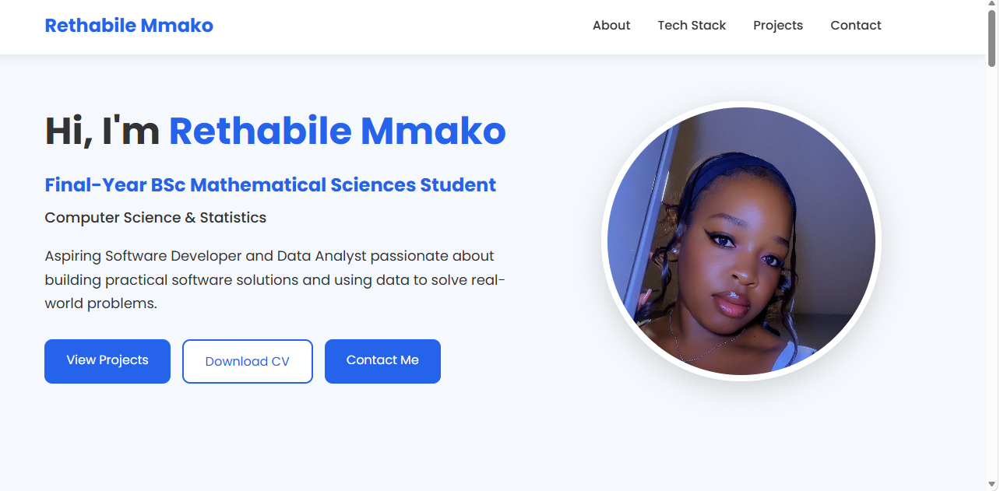

# 💼 Personal Portfolio

## 🌟 About

Welcome to my personal portfolio website!

I am a final-year Bachelor of Science in Mathematical Sciences student majoring in **Computer Science** and **Statistics** at **Sefako Makgatho Health Sciences University (SMU)**.

This portfolio was built to showcase my technical skills, projects, and passion for software development and data analytics. It serves as a central place where recruiters can learn more about me, explore my work, and access my CV.

---

## 🌐 Live Website

**Portfolio:**  
https://thabi1405.github.io/personal-portfolio/

---

## 🚀 Features

- Responsive design
- About Me section
- Tech Stack section
- Project showcase
- Downloadable CV
- GitHub links
- LinkedIn profile
- Contact section

---

## 🛠 Technologies Used

- HTML5
- CSS3
- JavaScript
- Git
- GitHub
- GitHub Pages

---

## 📂 Featured Projects

### 🎓 Student Management System
A Java console application that allows users to register, search, update, and delete student records using Object-Oriented Programming.

### ✅ TaskFlow
A task management web application built with Flask that allows users to create, edit, complete, and delete daily tasks.

### 🌦 Weather Dashboard
A web application that displays real-time weather information using a weather API.

### 📊 Retail Sales Analytics Dashboard
A business intelligence dashboard used to analyse retail sales performance and provide meaningful business insights.

---

## 📄 Resume

A downloadable copy of my CV is available directly from my portfolio website.

---

## 👤 Author

**Rethabile Mmako**

📧 Email: budgy1405@outlook.com

💼 LinkedIn:
https://www.linkedin.com/in/rethabile-mmako-171176346

🐙 GitHub:
https://github.com/thabi1405

🌐 Portfolio:
https://thabi1405.github.io/personal-portfolio/